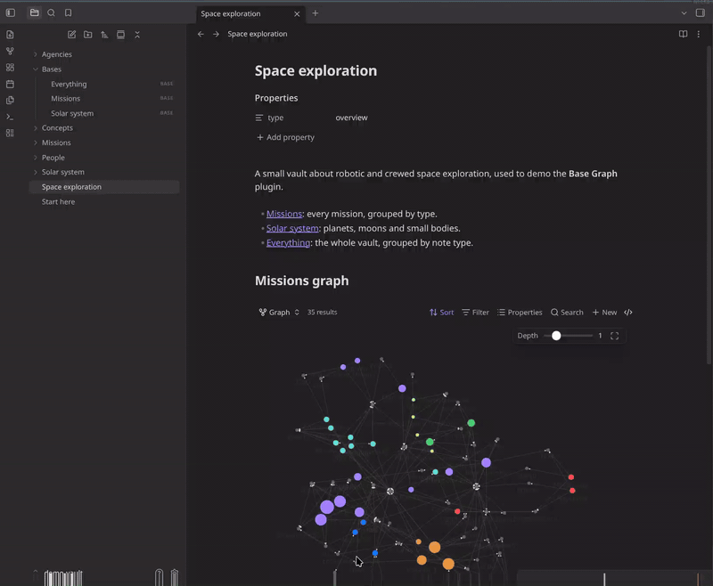
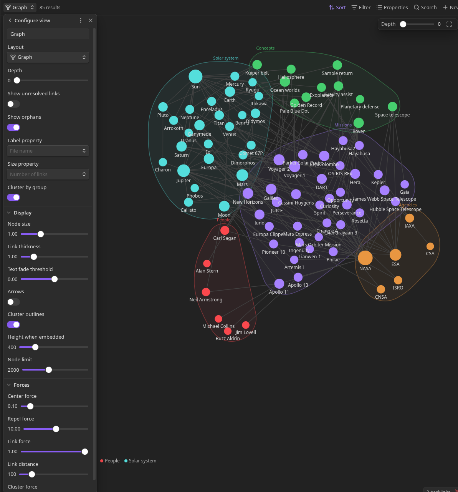
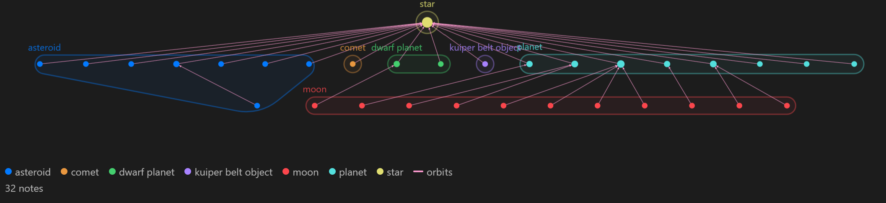
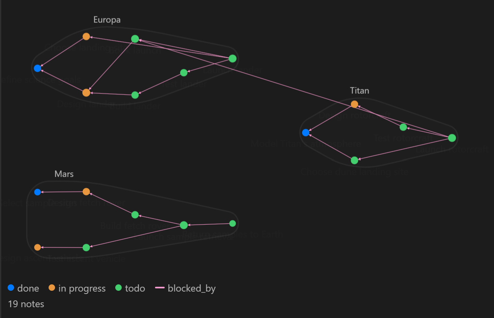

# Base Graph

Adds a **Graph** view to [Obsidian Bases](https://help.obsidian.md/bases). The notes a base returns are drawn as a force-directed graph, like the core graph view.



- **Filters:** use the normal Bases toolbar to add, edit and remove filters. The graph updates as you change them.
- **Depth:** like the local graph, also show notes up to _n_ links away from the base's results. Choose whether to follow links, backlinks or both.
- **Groups:** if the base is grouped, each group gets its own colour and appears in the legend. When grouped by a list property, each item in the list is its own group, and a note with several items is split equally between their colours.
- **Link properties:** draw only the links in chosen properties, such as `parent` or `blocks`, to graph relationships like an org chart or task dependencies. Each property's links get their own colour.
- **Layouts:** a free force-directed layout, rings by link distance from the base's results, or layers for hierarchies such as `parent` links, running top to bottom, bottom to top, or sideways.
- **Clusters:** optionally pull notes that share a property value together, separately from how they're coloured.
- **Embeds:** works anywhere a base does, including `![[Projects.base#Graph]]` and inline `base` code blocks.

Requires Obsidian 1.10.2 or later with the Bases core plugin turned on.

## Usage

1. Open a `.base` file. In the view switcher, select **Add view**, then choose **Graph**.
2. Set up filters from the toolbar as you would for a table.
3. Drag the **Depth** slider in the top right to include linked notes. They take the colour of their group but are drawn faded, so you can tell them apart from notes the base matched.

Using the graph:

- Select a node to open it. Hold <kbd>Ctrl</kbd>/<kbd>Cmd</kbd> to open it in a new tab.
- Drag nodes to move them. Scroll to zoom, and drag the background to pan.
- Hover a node to see the properties chosen in the toolbar's **Properties** menu, rendered as they are in a table. Empty values are left out. Move onto the card to select its links.
- Select the pin on the card, or **Pin highlight** in the node's menu, to keep that note and its links highlighted. Select an empty part of the graph to unpin it.
- Hover with <kbd>Ctrl</kbd>/<kbd>Cmd</kbd> held for a page preview.
- Right-click a node for the file menu.
- Hover an item in the legend to highlight that group's notes or that link property's links. Select it to keep the highlight, and select it again to clear it. Hold **Ctrl** (**Cmd** on macOS) while selecting to highlight several items at once.

### View options

These are under the view's settings in the Bases toolbar and are saved in the `.base` file.

| Option | Description |
| --- | --- |
| Depth | How many links away from the base's results to include (0–5). |
| Follow | Follow links, backlinks, or both when expanding depth. |
| Layout | **Free**; **Rings by depth** to put the base's notes in the middle and linked notes in a ring for each step away; or **Layered** for one-way links such as `parent`. See [Layered layout](#layered-layout). |
| Direction | With **Layered**, which way the layers run: **Top to bottom**, **Bottom to top**, **Left to right** or **Right to left**. |
| Lay out clusters separately | With **Layered** and clusters, give each cluster its own layers instead of sharing them. See [Layered layout](#layered-layout). |
| Include attachments | Include linked attachments when expanding depth. |
| Link properties | Names of note properties to draw links from, such as `parent` or `related`. Depth follows only these links. Leave empty to use all links. |
| Include other links | With link properties set, also draw all other links, in the usual colour. |
| Show unresolved links | Show links to notes that don't exist. |
| Show orphans | Show results that aren't linked to anything in the graph. |
| Label property | Property to use as the node label. Defaults to the file name. |
| Size property | Numeric property that sets node size. Defaults to the number of links. |
| Cluster by group | Cluster notes by the base's groups instead of by a property. Notes in several groups, from a list, are in each of their groups' clusters. |
| Cluster by | Property whose values the notes are clustered by. Notes without a value aren't clustered. Each cluster gets a faint outline, background and label, in its group's colour if all its notes share one. |
| Display | Node size, link thickness and opacity, scale links by link count, text fade threshold, arrows, cluster outlines, height when embedded, and the node limit. |
| Forces | Center, repel and link forces, and link distance. Link distance also sets the gap between rings, and in **Layered** the gap between layers and the least space between notes in a layer. Cluster force sets how tightly clusters pull together, and cluster repel force how firmly notes are kept out of clusters they aren't in. |



### Layered layout

**Layered** suits links that only go one way, such as a `parent` property, task dependencies, or moons that orbit planets that orbit the Sun. Notes that don't link to anything are in the first layer, the notes linking to them are in the next layer, and so on. With **Direction** set to **Top to bottom**, the first layer is the top row. Linked notes are lined up with each other, and with clustering on, each cluster's notes stay together in every layer. When two notes link to each other through the same property, that link is ignored when placing them. When properties disagree, such as `blocked_by` and `blocks` between the same notes, the property listed first in **Link properties** decides, and other links come last.



Turn on **Lay out clusters separately** to lay out each cluster as its own small graph instead, from only the links inside it, with the clusters packed into rows to fit the view. Links between clusters are still drawn, but don't affect where notes go.



### Embedding

Embed a view from a `.base` file:

```markdown
![[Projects.base#Graph]]
```

Or define the base inline. Filters can refer to the note it's embedded in with `this`. For example, this shows the notes linking to the current note and everything linked to them:

````markdown
```base
filters:
  and:
    - file.hasLink(this.file)
views:
  - type: base-graph
    name: Linked notes
    depth: 1
    height: 500
```
````

## Development

```bash
npm install
npm run dev     # watch build
npm run build   # production build
npm run lint
```

To test, copy `main.js`, `manifest.json` and `styles.css` to `<Vault>/.obsidian/plugins/base-graph/`, reload Obsidian, and turn on **Base Graph** in **Settings → Community plugins**.

### Layout

```
src/
  main.ts                 Registers the Bases view and hover source
  constants.ts
  graph/
    linkIndex.ts          All links, plus a lazily built backlink index
    propertyLinks.ts      Only the links in chosen properties, from frontmatter links
    buildGraph.ts         Base results → nodes and links, with depth expansion
    types.ts
  view/
    GraphBasesView.ts     The BasesView: rebuilds on data and link changes, opens files
    options.ts            View options and reading them from the view config
    clusters.ts           Assigns clusters from the base's groups or a property
    controls.ts           Depth slider, fit button, status line and legend
    entries.ts            Looks up entries, creating them for linked notes outside the base
    groups.ts             Maps notes, including linked ones, to the base's groups, splitting lists
    propertyCard.ts       Hover card listing the view's selected properties, with a pin button
  render/
    renderer.ts           d3-force simulation, zoom/pan, dragging, hit testing
    clusterForce.ts       Forces pulling each cluster together and keeping other notes out of it
    clusterShapes.ts      Cluster outlines, backgrounds and labels
    rings.ts              Ring sizes for the rings by depth layout
    layers.ts             Layers, and the order within them, for the layered layout
    layered.ts            Positions for the layered layout, packing clusters laid out separately
    layerForces.ts        Forces holding notes in their layers and lining up linked notes
    hull.ts               Convex hulls and rounded outlines for cluster shapes
    draw.ts               Canvas drawing
    theme.ts              Reads graph colours from the current theme
```
